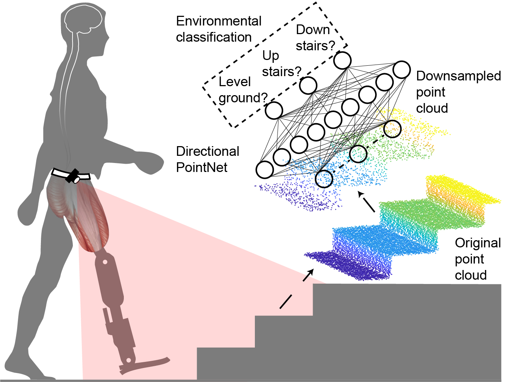

# Directional PointNet: 3D Environmental Classification for Wearable Robots

  

We propose a directional PointNet to directly classify the 3D point cloud. First, an inertial measurement unit (IMU) is used to offset the orientation of point cloud. Then the directional PointNet can accurately classify the daily commuted
terrains, including level ground, climbing up stairways, and walking down stairs. A classification accuracy of 98% has been achieved in tests. Moreover, the directional PointNet is more efficient than the previously used PointNet because the T-net, which is utilized to estimate the transformation of the point cloud, is not used in the present approach, and the length of the global feature is optimized. The experimental results demonstrate that the directional PointNet can classify the environments in robust and efficient manner. 

  ## Contact

  For more related works and codes, please view my homepage: https://kuangenzhang.github.io/

Further information please contact Kuangen Zhang (kuangen.zhang@alumni.ubc.ca).

  ## Citation
If you find our work useful in your research, please consider citing:
```bash
@article{zhang_directional_2019,
	title = {Directional pointnet: 3D environmental classification for wearable robotics},
	shorttitle = {Directional {PointNet}},
	urldate = {2019-03-22},
	journal = {arXiv:1903.06846 [cs]},
	author = {Zhang, Kuangen and Wang, Jing and Fu, Chenglong},
	month = mar,
	year = {2019}
}
```
  ## Overview
`Directional pointnet` is the simplified version of pointnet. We have evaluated our network on classifying three kinds of terrains: level ground, up stairs, and down stairs.

  * Classification accuracy: **98%**.

  ## Requirements
  * [TensorFlow](https://www.tensorflow.org/)
  * h5py
  ```bash
  sudo apt-get install libhdf5-dev
  sudo pip install h5py
  ```

  ## Point cloud classification

  * We upload our pretrained model and data, you can evaluate the performance of our network directly by running the evaluation script:
  ``` bash
  python evaluate.py
  ```
  * Run the training script:
  ``` bash
  python train.py
  ```

  ## License
MIT License

  ## Acknowledgement
We  acknowledge that we borrow the code from [PointNet](https://github.com/charlesq34/pointnet) heavily. 

  ## Reference
  * C.  R.  Qi,  H.  Su,  K.  Mo,  and  L.  J.  Guibas,  “PointNet: Deep  Learning  on  Point  Sets  for  3d  Classification  and Segmentation,”  in2017  IEEE  Conference  on  Computer Vision  and  Pattern  Recognition  (CVPR),  Jul.  2017,  pp.77–85, read.
